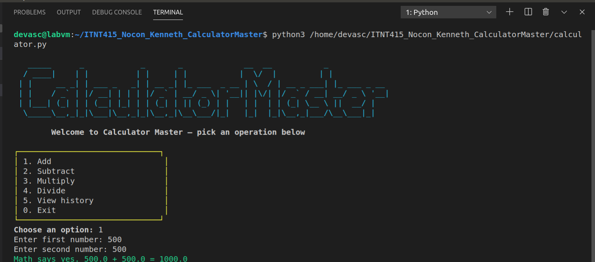

# ITNT415 Calculator Master

## Student Information
- **Name:** Kenneth Nocon
- **Course & Section:** [fill in your section, e.g. ITNT415 - X1]

## Project Description
A menu-driven Python calculator built using a Git/GitHub feature-branch workflow.
Each arithmetic operation (addition, subtraction, multiplication, division) was
developed on its own branch, tested, and merged into `main` via a Pull Request.
The calculator includes input validation and handles division by zero.

## Branch Structure
- `addition_Nocon` — implements the addition operation
- `subtraction_Nocon` — implements the subtraction operation
- `multiplication_Nocon` — implements the multiplication operation
- `division_Nocon` — implements the division operation, including division-by-zero handling

All branches were merged into `main` via Pull Requests on GitHub.

## Program Features
- Menu-driven interface (Add, Subtract, Multiply, Divide, View History, Exit)
- Input validation (rejects non-numeric input and re-prompts)
- Division-by-zero handling with a clear error message
- Session calculation history (viewable from the menu)
- Continuous execution until the user chooses to exit

## Sample Execution
